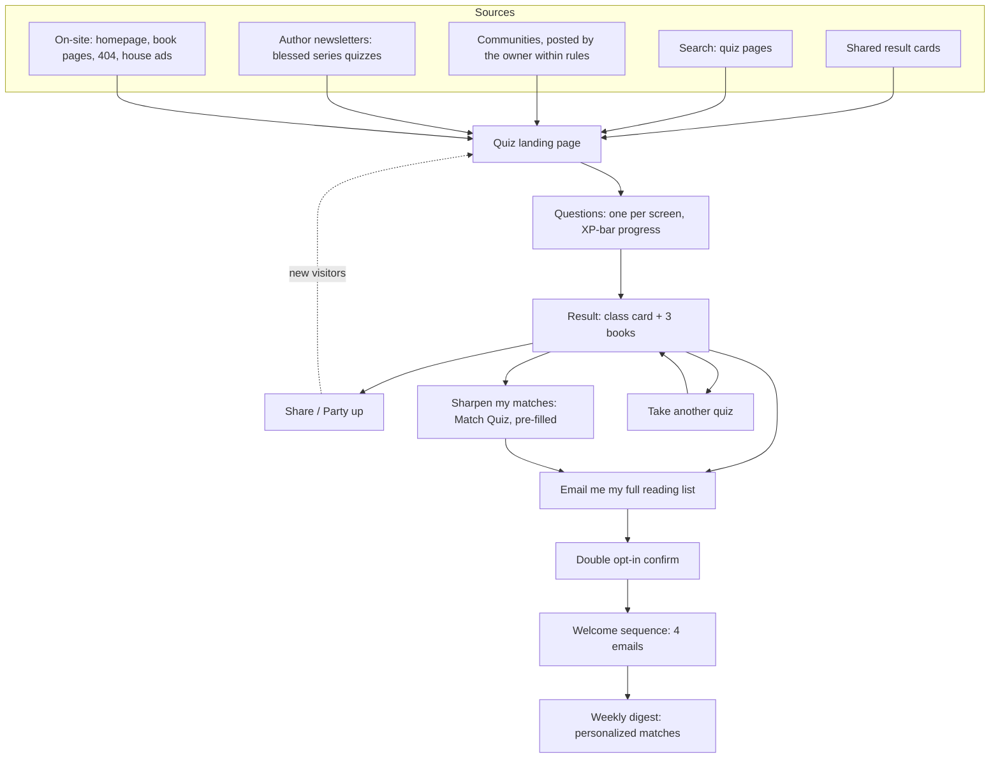

# Quizzes: Drafts, Lead Generation and Onboarding

| | |
|---|---|
| **Status** | Draft v1.0 |
| **Last updated** | 2026-09-26 |
| **Design context** | [`DESIGN.md` §9.3](./DESIGN.md#93-fun-quizzes-lead-magnets-that-double-as-matching) (fun quizzes), [§9.1](./DESIGN.md#91-match-engine-the-headline-feature) (Match Quiz), [§7.16](./DESIGN.md#716-quiz-factory) (quiz factory) |
| **Quiz content** | `data/quizzes/*.json` is the source of truth. Readable previews are generated in [`docs/quizzes/`](./quizzes/) |
| **Checker** | `node scripts/quiz-tool.mjs check` validates every quiz and runs the balance simulation. `render` also rewrites the previews |

Quizzes do three jobs at once:

1. **Lead magnet.** Personality quizzes are among the most shared formats online.
2. **Taste signal.** Every answer secretly nudges the reader's dials, must-have stats and tags.
3. **Onboarding.** A quiz is the friendliest possible first step into a taste profile.

**Every quiz ends in books.**

---

## 1. The lineup

| Quiz | Role | Length | Results | Status |
|---|---|---|---|---|
| [What's Your LitRPG Class?](./quizzes/whats-your-litrpg-class.md) | **Flagship lead magnet.** Its results are the site-wide reader classes | 10 questions, ~90 s | 12 reader classes | Draft, balanced |
| [Which LitRPG MC Are You?](./quizzes/which-litrpg-mc-are-you.md) | Second lead magnet; strong share hook | 8 questions, ~75 s | 8 MC archetypes | Draft, balanced |
| [What Would Your System Be Like?](./quizzes/what-would-your-system-be-like.md) | Tone, crunch and lore signal disguised as a joke | 6 questions, ~60 s | 6 System personalities | Draft, balanced |
| [Would You Survive the Tutorial?](./quizzes/would-you-survive-the-tutorial.md) | Humor-first; pace, danger and strategy signal | 6 questions, ~60 s | 6 fates | Draft, balanced |
| Match Quiz | Precision tool, not a personality quiz ([`DESIGN.md` §9.1](./DESIGN.md#91-match-engine-the-headline-feature)) | 9 steps, skippable | Ranked matches | Specified |
| Series quizzes: DCC, He Who Fights With Monsters, Cradle | Fan favorites, **made with the author's blessing** (§6) | ~8 questions each | Characters / essences / Paths | Brief only |

**Backlog ideas** (for the quiz factory once the launch set proves out):

- *What's your starting skill in the System Apocalypse?*
- *Which dungeon floor would you die on?*
- *What cultivation realm are you stuck at?*
- *Pick a loot table and we'll pick your next read.*
- *Which snarky System announcement are you?*
- Seasonal quizzes: *Build your Halloween dungeon*, *What's in your holiday loot box?*

---

## 2. How results and profiles are computed

### 2.1 Picking the result

- Each answer awards **personality points**: ★ = 2 points to its primary result, ☆ = 1 point to a secondary result.
- The result with the most points wins. **Ties** break on:
  1. how many chosen answers had that result as their primary;
  2. the latest question whose chosen answer points at one of the tied results. The final question is the "soul" question, so it matters most.
  3. If still tied, list order.
- **Quality bar**, enforced by `scripts/quiz-tool.mjs`:
  - Every result is the primary of at least 3 answers.
  - Every result is **reachable** by always picking its most favorable answers.
  - A **balance simulation** of 10,000 random quiz-takers keeps every result between 0.24× and 2× an even share. For 8 results that's 3%–25%. For the class quiz's 12 results, 2%–16.7%.

  The four drafts currently land between 6.5% and 18.3%, close to even. Balance numbers are in each preview.

### 2.2 Reader classes are site-wide

The 12 reader classes in [`data/quizzes/reader-classes.json`](../data/quizzes/reader-classes.json) aren't just quiz results. They are used for:

- the **reader class card** that any match profile maps to ([`DESIGN.md` §7.8](./DESIGN.md#78-match-engine-similarity-and-recommendations)): the nearest class to the reader's dials and stats;
- the reader's profile and the weekly digest header ("This week for The Min-Maxer");
- aggregate insights on book pages: "Most loved by: The Min-Maxer 41% · The Underdog 22%". This is shown only when at least 20 readers are in the aggregate.

Each class has a **starting profile** (dial targets, must-have stat floors, tag affinities) and 1–2 **calibration books** for the owner to confirm. When the catalog has dials, the owner checks that each class's starting profile sits near its calibration books and adjusts it if not. Calibration books are never shown to readers as-is; the match engine picks live recommendations.

### 2.3 From answers to a taste profile

Each answer carries **effects**:

- **Dial nudges:** −2 to +2.
- **Must-have signals** on book stats: +1 or +2.
- **Tag affinities:** −1 to +3.

After the quiz:

```
Dials:  s_d        = sum of nudges for dial d
        target_d   = clamp(5 + 1.25 · s_d, 0, 10)
        importance = min(1, |s_d| / 4) · 0.3          # 0.3 = quiz.fun_effect_importance

Stats:  floor_s    = min(8, 5 + 1.5 · sum of signals)
        importance = min(1, sum / 3) · 0.3

Tags:   affinity_t = sum of answer affinities + result seed affinities

Blend with the result's starting profile:
        target = average of seed and answers where both exist
        importance = max(answer importance, 0.3 · seed importance)
```

Fun-quiz signal is deliberately **low importance**, because people answer in character. Anything stronger overrides it right away: rated books, the Match Quiz, marks, appraisals. The profile stores each signal with its source, so nothing is lost when better data arrives.

---

## 3. Lead-gen funnel



### 3.1 Traffic sources

| Source | How | Rules |
|---|---|---|
| **Shared result cards** | Every result has its own URL (`/quiz/{slug}/r/{outcome}`) and OG image. Native share, copy link, download card | The card never contains personal data |
| **Party up** (viral loop) | "Invite your party" link. A friend who takes the quiz sees both classes, a **party composition** ("Min-Maxer + Party Main: the planner and the heart") and a **party reading list** of books both profiles score highly | Only the two results are compared, never answers |
| **Search** | Quiz landing pages target "what LitRPG class am I", "which LitRPG MC are you", and later "which DCC character are you" | Indexable, fast, no interstitials |
| **Communities** | The owner posts quizzes in r/litrpg, r/ProgressionFantasy, Discords and Facebook groups **only where rules allow** (fun-flair days, self-promo threads) | Never automated. Participate as a reader first |
| **Authors** | Blessed series quizzes (§6) get shared to the author's newsletter and socials | The author approves the final quiz |
| **On-site** | A quiz row on the homepage ("Not sure what you like? Find your class in 90 seconds"); "Most loved by…" on book pages linking to the class quiz; the 404 page ("You've wandered off the map. Find your class while you're here"); **house ads** in unsold slots (DESIGN §11.9); the newsletter footer | No pop-ups, no exit-intent tricks |
| **Existing subscribers** | New quizzes are announced in the digest. Each one adds signal | At most one quiz announcement a month |

### 3.2 Quiz page UX

- **Landing:** title, a one-line promise, a big **Start** button with the time estimate, and a count of adventurers classified so far. **No signup** to start or to see the result.
- **Questions:**
  - One per screen, with the System-notification flavor line (`[AMBUSH!]`).
  - Tap to advance; a back button.
  - Progress shown as an XP bar.
  - Works with a keyboard and a screen reader.
  - Under 2 minutes.
- **Result page, top to bottom:**
  1. **Class card**, styled as a status screen, with the tagline and description.
  2. **You'll love / Watch out for.**
  3. **3 books for your class**, picked live by the match engine from the quiz profile. Each gets a mini status screen and buy links. At most one is a Sponsored Match, and only if it scores ≥ 70% for this profile.
  4. **Share** · **Party up** · **Email me my full reading list** · **Sharpen my matches (2 min)** · **Take another quiz**.

### 3.3 Email capture

- **Button:** "Email me my full reading list".
- **Form:** one email field plus Turnstile. The text under it: *"We'll send your {Class} reading list and a weekly email of new matches. One click to unsubscribe. We never share your email."* A small link offers **"Just the list, no weekly email"** instead.
- **Double opt-in:** the confirmation subject is *"Confirm to get your {Class} reading list"*.
- **While they wait**, the confirmation page says: *"Check your inbox. While you wait: rate 3 books you've read and your list gets better."* This is the Match Quiz's step 1, the single most valuable signal.
- **Consent record:** `source = quiz:{slug}:{outcome}` (DESIGN §13.3). Rate limits and Turnstile as in DESIGN §15.9.

### 3.4 Welcome sequence (fully automated)

| # | When | Subject (draft) | Content | Signal it asks for |
|---|---|---|---|---|
| E0 | Immediately | Confirm to get your {Class} reading list | Double opt-in link | Confirmation |
| E1 | On confirm | Your {Class} reading list is here | 10 books picked for **their** profile, not just the class: 3 best bets with status screens, then 7 more. Each book has one-click *Read it / Loved it / Not for me* | Book marks |
| E2 | Day 2 | Your class is a starting point | "Rate 12 classics in 60 seconds and your matches get much sharper" (Match Quiz step 1) | Rated books, the biggest profile gain |
| E3 | Day 5 | New and upcoming for {Class} | New & upcoming books matching the profile, "Follow a series you love", and one other quiz (the quiz ladder) | Follows, a second quiz |
| E4 | Day 9 | Your first weekly matches | The reader joins the weekly digest. Explains the preferences page and one-click unsubscribe | — |

- **Skip rules:** if the reader already did what an email asks (took the Match Quiz, followed a series), that email's call to action is swapped for the next useful one.
- **Low engagement:** readers with no clicks on E1–E3 get the digest every other week until they click.
- **One-click email choices** ("Loved it") open a page with the choice pre-selected and a confirm tap. Email link scanners can't record choices (DESIGN §15.2).
- The "Just the list" option gets E0 and E1 only.

### 3.5 Targets (starting points; tune after 1,000 completions per quiz)

| Step | Target |
|---|---|
| Landing → start | ≥ 60% |
| Start → completed | ≥ 75% |
| Completed → shared | ≥ 8% |
| Completed → email submitted | ≥ 15% |
| Email → confirmed | ≥ 65% |
| E1 click rate | ≥ 40% |
| E2 → rated ≥ 5 books | ≥ 25% |
| 30-day active subscribers | ≥ 35% |

The quiz factory's weekly report (DESIGN §7.16) tracks these per quiz, plus drop-off per question. **A/B tests** of CTA copy and result layout are picked automatically once a variant clearly wins after ≥ 500 completions per arm. Results go into the owner's weekly summary.

---

## 4. Onboarding integration

### 4.1 One profile, many front doors

Every entry point produces the same kind of taste profile and a reader class:

| Front door | What we learn | Starting profile level |
|---|---|---|
| Fun quiz → email | Class + low-importance partial profile | 2 |
| Books you loved → save | 1–5 loved (and bounced-off) books | 3 |
| Match Quiz → save | Rated books, dials, must-haves, hard no's | 4 |
| Goodreads / StoryGraph import | Ratings and shelves | 4, or 5 with ≥ 20 rated books |
| Plain newsletter signup | Nothing yet | 1. The first email offers the class quiz |

### 4.2 Profile levels (progressive profiling, LitRPG-style)

The reader's profile has a level and an XP bar, and **each level visibly improves their matches**. Each email and page asks for **at most one** next step.

| Level | Title earned | How to reach it | What improves |
|---|---|---|---|
| 1 | *Unclassified* | Email only | Generic "popular this week" picks |
| 2 | *Classified* | Any quiz | Class-based picks |
| 3 | *Well-Read* | Rate or mark ≥ 5 books | Real personalized matches |
| 4 | *Fine-Tuned* | Set must-haves and hard no's | Heads-ups and precise filtering |
| 5 | *Appraiser* | Appraise ≥ 3 books, or import ≥ 20 rated books | Best matches, and you're helping everyone else's |

A "match confidence" meter on the results page and the profile page shows the benefit ("Level 3: matches are 2× more accurate than Level 1", measured by the offline eval, DESIGN §7.14).

### 4.3 Carrying quiz results into an account

- **No account needed to take a quiz.** A random take ID is kept in the browser's local storage. It's functional storage for the reader's own results, not analytics, and nothing is sent to third parties.
- When the reader gives their email or signs in **on the same browser**, their takes attach to their profile (`quiz_takes.user_id`). They can see and delete them in their account.
- Takes that are never attached are reduced to aggregates after 90 days (DESIGN §16.2).
- **Retakes** are allowed. The latest take's effects replace the earlier ones from the same quiz; history is kept for the reader.

### 4.4 Where quizzes show up in the product

- **Signup:** after email confirmation, "How should we learn your taste?" offers **Quick quiz (90 s)** · **Rate books (60 s)** · **Import Goodreads** · **Skip**.
- **Profile page:** class card, profile level and XP bar, quizzes taken, and "Retake".
- **Weekly digest:** a "This week for {Class}" header. One house slot promotes a quiz of the month until paid ads fill it.
- **Match results:** the reader class card is generated from any profile, so Match Quiz users get a class without taking the class quiz.
- **Book pages:** "Most loved by" class breakdown (aggregate, k ≥ 20), linking to the class quiz.

### 4.5 Privacy

- Quiz answers are **never** shown to authors or advertisers.
- Aggregates such as class breakdowns are shown only when at least 20 readers are included.
- No third-party pixels on quiz pages. Share cards contain the result only.
- Everything above follows DESIGN §16.

---

## 5. Writing guidelines

- **Voice:** playful, genre-literate, second person. Use System-notification flavor lines. Affectionate, never mean. Even "Died Immediately" is a compliment.
- **Answers:** at most 90 characters (the checker enforces this). Every answer should be tempting; avoid an obviously "correct" one.
- **Fairness:** no gendered assumptions, no real-world politics. Fun quizzes don't ask about gender at all; the Match Quiz handles MC-gender preference.
- **Spoilers:** none in IP-free quizzes. Series quizzes state their spoiler boundary up front.
- **Structure:**
  - 6–10 questions, 3–6 answers each.
  - Every result is the primary of at least 3 answers, with secondaries spread around.
  - The final question is the "soul" question used in tie-breaks.
- **Signal:** every answer carries at least one effect (the checker enforces this). Effects should match the answer's vibe; a cozy answer shouldn't nudge `danger` up.

---

## 6. Series quizzes and author partnerships

**Process:**

1. Pick a series with a big, active fandom.
2. Send the outreach email below.
3. If the author says yes, the quiz factory drafts the quiz from the brief. The author reviews results and the spoiler boundary and can add official art.
4. Publish with an **Official** badge (`is_official`) and the permission recorded (`permission_ref`).
5. The author shares it.

The first few are free partnerships. Later, the **Official Series Quiz** becomes a paid product with an optional opt-in to the author's newsletter (DESIGN §11.2).

**No reply after two polite follow-ups:** either skip the series, or publish an unofficial fan version under the DESIGN §16.5 rules (our own words, no official art, spoiler boundary, disclaimer, removal on request). This is the owner's call per series (DESIGN §22 D17).

### 6.1 Outreach email template

> **Subject:** A "Which {Series} character are you?" quiz for your readers?
>
> Hi {Author},
>
> I run ReadLitRPG.com, a free site that helps LitRPG and progression fantasy readers find their next book. I'd love to make a **"Which {Series} character are you?"** quiz, with your blessing.
>
> - You'd review every question and result before anything goes live, and set the spoiler limit (we'd suggest nothing past book {N}).
> - It would carry an "Official" badge, with prominent links to your books.
> - It's free. If you'd like, readers who take it can opt in to your newsletter.
>
> If you'd rather we didn't, no problem at all, and thanks for the books either way.
>
> {Owner name}
> ReadLitRPG.com

### 6.2 Briefs (drafted by the quiz factory once permission is in hand)

These are deliberately not written yet. They need the author's OK and a spoiler review, and results must describe characters in our own words.

| Quiz | Brief |
|---|---|
| **Which DCC crawler are you?** (*Dungeon Crawler Carl*, Matt Dinniman) | 8 questions, 8 results drawn from characters introduced by book 1. Spoiler boundary: book 1. Voice: the System AI's announcements. Effects lean `humor`, `danger`, `combat`, `snarky-system` |
| **What would your essences be?** (*He Who Fights With Monsters*, Shirtaloon) | 8 questions. Result: three essences plus the confluence they form, described in our own words. Spoiler boundary: book 1. Effects lean `ensemble`, `humor`, `rule_of_cool`, `build_payoff` |
| **What's your Path?** (*Cradle*, Will Wight) | 8 questions, 8 results. Spoiler boundary: book 1. Effects lean `earned_power`, `progression_speed`, `training-arcs`, `cultivation` |

---

## 7. Implementation notes

- **Format:** each quiz is one JSON file in `data/quizzes/`: `slug`, `title`, `dek`, `status`, `questions[].options[]` with `points` and `effects`, plus `outcomes` (or `"outcomes_from": "reader-classes"`). This maps one-to-one onto the `quizzes`, `quiz_items` and `quiz_outcomes` tables (DESIGN §5.6). M1 seeds them from these files.
- **Checker:** `scripts/quiz-tool.mjs` validates keys against the dial and stat lists and against `TAXONOMY.md`, checks reachability and runs the balance simulation. The quiz factory (DESIGN §7.16) reuses the same rules before any quiz reaches the owner's inbox.
- **Build placement:**
  - **M3:** quiz engine, result pages, share cards, Party up, the four launch quizzes.
  - **M5:** email capture, the welcome sequence, profile levels.
  - **M7:** quiz analytics in the owner's weekly report.
