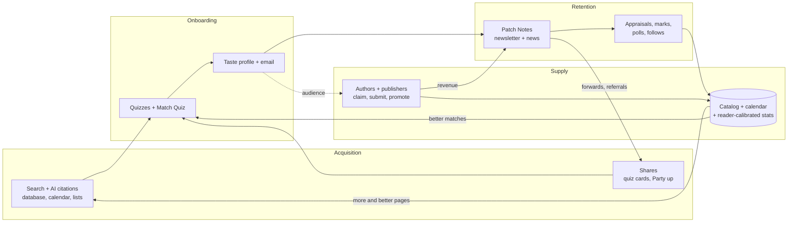

# ReadLitRPG Strategy

| | |
|---|---|
| **Status** | v1.0 |
| **Last updated** | 2026-09-26 |
| **Related** | [`DESIGN.md`](./DESIGN.md) (how it's built) · [`QUIZZES.md`](./QUIZZES.md) (onboarding funnel) |

## 1. The thesis

Three layers, each with one job, all feeding one flywheel:

| Layer | Job | What readers see | Why it holds up when AI answers everything |
|---|---|---|---|
| **Database + calendar** | **Get found** (acquisition via search) | Book, series, author and narrator pages; "books like X"; tag pages; living lists; stat leaderboards; the release calendar | Fresh, specific, structured facts, especially **upcoming releases**, which no AI model knows. Long-tail queries. We aim to be the source AI answers cite |
| **Matching + quizzes** | **Turn visitors into profiles** (onboarding) | The match engine, the Match Quiz, fun and series quizzes, saved searches and alerts | Interactive and personal. Results depend on our live catalog and reader-calibrated data, not on text a model can repeat |
| **Newsletter + news blog: *Patch Notes*** | **Keep them** (retention and brand) | The weekly *Patch Notes* email and the `/news` section: news, data stories, polls, author interviews | An owned relationship with readers, built on primary information and community that AI can summarize but can't originate |

Together they create a network effect (§3): more readers produce better data and attract more authors; more authors produce a fresher catalog and more pages; better data and a bigger catalog attract more readers.

---

## 2. What "AI-proof" actually means

AI can summarize anything public. What it can't do is **originate**:

1. **Our data:** reader-appraised book stats, the release calendar, match and follow data, poll results.
2. **Relationships:** authors who send us their news and answer interview questions; subscribers who reply.
3. **Community:** votes, tier lists, quiz results, reader classes, the annual Reader Awards.
4. **Freshness:** what changed this week.
5. **Voice:** a consistent personality readers recognize (the friendly System announcer, [`QUIZZES.md` §5](./QUIZZES.md#5-voice)).

**The rule:** every *Patch Notes* issue and every news post contains **at least one proprietary input**: our data, reader votes, an author's own words, or news we reported first. AI does the assembly and drafting. The value comes from the inputs. A post that's only AI commentary on public information doesn't get published, because an AI assistant could write it for anyone.

"AI-proof" doesn't mean "no AI". The site is heavily automated. It means readers get things from us that they can't get from asking an assistant.

---

## 3. The flywheel

The loops that compound:

| Loop | How it works | When it starts to show |
|---|---|---|
| **Data** | Readers appraise, mark and rate books → stats and matches get more accurate → better experience → more readers | Visible at ~5k active readers; strong at ~50k |
| **Marketplace** | Readers attract authors → authors claim listings, submit releases and buy promotions → the catalog and calendar get fresher and bigger → more search pages and better matches → more readers | Authors start coming on their own at ~5–10k subscribers |
| **Social** | Quiz cards, Party up invites, forwards and referrals → new readers who arrive already onboarding | From day one |
| **Brand** | *Patch Notes* earns trust → replies, votes and news tips → content only we have → shares → more subscribers | From the first issue; compounds slowly |

**Being honest about the moat:**

- **Real, compounding advantages:** the owned email list; reader-calibrated stats and appraisals; author relationships; the brand.
- **Not advantages:** the software, the prompts, the taxonomy. All are copyable.

So we measure and invest in the first group (§7).

---

## 4. Layer 1: the database and calendar for search

**Page types and the searches they target:**

| Page | Example search |
|---|---|
| "Books like X" (every book) | "books like dungeon crawler carl" |
| Tag pages | "dungeon core litrpg" |
| Living lists | "completed litrpg series with audiobooks", "litrpg no harem" |
| Release calendar (month and week pages) | "litrpg releases november 2026", "new progression fantasy audiobooks" |
| Series pages | "primal hunter reading order", "cradle book 12 release date" |
| Author and narrator pages | "[author] books in order", "[narrator] litrpg audiobooks" |
| Stat leaderboards | "litrpg with competent mc" |
| Quizzes | "what litrpg class am i", "which dcc character are you" |

**Freshness is the edge.** Upcoming releases, date changes, new audiobooks and series completions update daily from author submissions, publisher feeds and the research agent ([`DESIGN.md` §7.15](./DESIGN.md#715-catalog-sourcing-without-scraping)). No model's training data has next month's releases.

**Be the source AI answers cite** (generative engine optimization):

- Every page answers its question in its first sentence ("*The Primal Hunter* has 12 books; book 13 is announced for…").
- Clean structured data: `Book`, `BookSeries`, `ItemList`, `Person`. Stable URLs, and visible "last updated" dates.
- **Crawler policy:** allow search and citation crawlers; block crawlers that only collect training data. Use robots.txt plus Cloudflare's AI-crawler controls:
  - Allow, for example: Googlebot, Bingbot, OAI-SearchBot, Claude-SearchBot, PerplexityBot.
  - Disallow, for example: GPTBot, Google-Extended, CCBot, ClaudeBot, Applebot-Extended.
  - Verify user-agent names at build time; they change.
- The match feature matrix and the bulk data stay behind rate-limited APIs ([`DESIGN.md` §15.2](./DESIGN.md#152-threat-model-and-controls)).

**Capture every visit, not just count it.** Each search landing page has one relevant capture:

- **Series pages:** "Follow this series."
- **Book pages:** "Alert me when a book like this comes out."
- **Everywhere:** "Find your match in 90 seconds."

Target: **≥ 2% of organic sessions leave an email.** This is also the answer to "zero-click" AI search: even a reader who only visits once should become a subscriber.

---

## 5. Layer 2: matching and quizzes for onboarding

Covered in [`QUIZZES.md`](./QUIZZES.md) and [`DESIGN.md` §9.1–9.3](./DESIGN.md#91-match-engine-the-headline-feature).

- Every entry point ends in the same place: **a taste profile, a reader class and an email**, with profile levels pulling the reader to add more signal over time.
- Quizzes double as the social loop: result cards, Party up invites and series quizzes spread through fan communities.
- The search layer feeds this layer. Every SEO page has a match or quiz entry point.

---

## 6. Layer 3: *Patch Notes*, the newsletter and news brand

**Name:** ***Patch Notes: this week in LitRPG***. It's the weekly email, and the news section at `/news` uses the same name. It's a genre-native name (every game update ships with patch notes), and it tells readers exactly what they're getting.

**Voice:** the friendly System announcer ([`QUIZZES.md` §5](./QUIZZES.md#5-voice)): dry, playful, genre-literate, clear first and funny second.

**Weekly issue**, sent Friday. Each section has a proprietary input:

| # | Section | What's in it | Proprietary input |
|---|---|---|---|
| 1 | **Your matches** | New and upcoming books that fit the reader's profile, with heads-ups | Their profile + our catalog |
| 2 | **Update log** | News: announcements, release-date changes, audiobook drops, completions, sales events, adaptations | Our release data + the news desk, first-reported or cited |
| 3 | **By the numbers** | One data point only we have, e.g. "Dungeon Core releases are up this quarter" or "the most-followed upcoming release" | Our database |
| 4 | **Reader poll** | One-tap vote; results in the next issue | Reader votes |
| 5 | **Author spotlight** | An interview excerpt, in the author's own words | Author relationship |
| 6 | **Quiz of the week** | A new or featured quiz | Brings in the people subscribers forward it to |
| 7 | **Sponsored** | At most 2 labeled slots ([`DESIGN.md` §11.5](./DESIGN.md#115-ad-serving)) | Matched to the reader |

**The news desk** runs automatically and cites every item:

1. **Our data:** new announcements, date changes and completions, detected from catalog changes.
2. **Author and publisher submissions:** a "Submit news" form for verified authors and publisher feeds.
3. **Weekly research-agent scan:** web search for publisher announcements, adaptations, awards and sales events. Every item needs a citation.
4. **Community:** poll results and tier lists.

Short, cited news briefs publish automatically after an editor-model review. Bigger stories and anything uncertain go to the inbox. **No rumors: every news item links its source.**

**Recurring tentpoles:**

- **Monthly *State of LitRPG***: releases by subgenre, audio lag, series completions and price trends, all from our database, with shareable charts. It works well for Reddit and press.
- **Annual *ReadLitRPG Reader Awards*** in December:
  - Readers nominate and vote by subgenre, and voting needs an email, which makes it the year's biggest signup event.
  - Winners get a badge on their book pages.
  - Authors campaign for votes, which sends their fans to us. This is the marketplace loop in one event.
- **Referrals:** each subscriber gets a referral link. Referral rewards are titles and cosmetic perks (*Party Leader* for 3 referrals, *Guild Master* for 10), never cash.

---

## 7. Metrics by layer

| Layer | North star | Supporting |
|---|---|---|
| **Search** | Organic sessions × email capture rate | Quality indexed pages; referrals from AI assistants; freshness (time from announcement to listing) |
| **Onboarding** | New profiles at level ≥ 2 per week | Quiz completion, email capture, profile-level distribution |
| **Brand** | Weekly engaged subscribers (clicked in the last 30 days) | Forwards and referrals, poll votes, replies, share of traffic from direct, newsletter and brand search (target ≥ 30% by end of year 2) |
| **Network** | Reader appraisals per week | Claimed authors, share of new releases submitted by authors, share of books with reader-calibrated stats |

The owner's weekly summary ([`DESIGN.md` §8.4](./DESIGN.md#84-owner-notifications)) reports one line per layer.

---

## 8. Sequencing

| When | What starts |
|---|---|
| **Launch** | Database pages, "books like X", living lists and quizzes live. *Patch Notes* ships weekly from the first subscriber, sections 1, 3, 4 and 6 at first |
| **Months 1–3** | News desk automation, author news submissions, polls, interviews in the issue |
| **Month 6** | First monthly *State of LitRPG* report; referral program |
| **December** | First *ReadLitRPG Reader Awards* |
| **Phase 2** | The full release calendar becomes a headline feature as author submissions scale ([`DESIGN.md` §3](./DESIGN.md#3-product-scope-by-phase)) |

---

## 9. Risks and responses

| Risk | Response |
|---|---|
| AI answer engines cut clicks from search | Capture on every page, structured data so we're the cited source, and a brand people come to directly |
| Search algorithm updates penalize scaled pages | Only publish pages with unique data; `noindex` thin pages; proprietary inputs rule |
| A competitor copies the database or engine | The moat is the list, the reader-calibrated data, author relationships and the brand, not the code |
| Newsletter fatigue | One issue a week, personalized, with a sunset policy ([`DESIGN.md` §13.3](./DESIGN.md#133-consent-and-compliance)) |
| Author pushback on fan quizzes or stats | Takedowns honored immediately; judgment stats shown only after reader appraisals |
